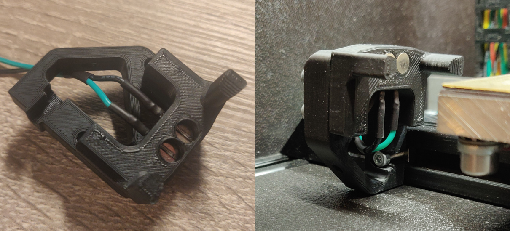

# Quickdraw - The Magnetic Microswitch Z Probe

## What is it?
Summarized the magprobe is a microswitch that can dock and undock on the toolhead of your printer. It touches the surface to make measurements. The magprobe has evolved a lot over time. Initially started as idea to keep a printer with broken inductive going with a cheap fix. Mental took the first steps to adapt it to a V2. Many branches rolled out of this design like the Piton probe. (https://github.com/Annex-Engineering/Annex_Engineering_PCBs/tree/master/piton_probe)

Currently the magprobe is a lot smaller, completely solderless and has macro's for automatic docking and undocking with failsafes. You can mount the dock on the bed or to the gantry. Mounting to the bed is more hidden but is more sensitive to misalignment. Many machines are already supported like the K1, K2, K3, V0, V1, V2, Legacy and Switchwire. Even more when you count in the mods that are made by other people.

Testing has shown the best switch for repeatability is the Omron D2F-5. You can also order the 5L model and remove the lever. A high temp substitute can be the Honeywell 411SX21-T. Downsides are is that its a lot more expensive and performs the same or worse. A genuine Omron D2F-5 should get you easily 1000H of use. Replacing the magprobe in your machine is a matter of seconds.

## Drop in replacement for PL-08N2 and similar
If you want to test the magprobe quickly there is a drop in replacement for the PL-08N2 and similar. We recommend to always use the carriages with baked in magprobe support. The magprobe will be closer and aligned to the nozzle, total weight lower, magnets further away from the buildplate and often comes with a bigger hotend cooling exhaust.

## Software
It is recommended to run Klipper (https://github.com/KevinOConnor/klipper). As of today theres already a macro available in the folders. We are working on an integrated klipper module.

## General installation instructions

Papejelly has made a video that can be found here: https://youtu.be/zLjfP3BHAIw

To assemble the magprobe push in the 2 6x3mm magnets against the pin of the switch. (Use the Omron D2F-5 or D2F 5L with lever removed. No substitutes) 

At the carriage side make 2 stacks of alternating polarity (it helps undocking). Crimp a male SM2.54 connector onto a cable and slide it against the magnets flush.

If you want to make use of probe dock detection crimp a male SM2.54 connector on a cable and clamp the flat part between the 2 magnets as pictured left. Additionally you need to bridge the M2 screws. This can be done by washers or a piece of hidden aluminum foil inside.

Its recommended to cut the center pin short on the switch. If you ever please to disassemble you can push out the switch through this centerhole.

## Gallery

## Support
If you need help assembling or have any other questions you are more them welcome in our Discord server. You can join us through this link here: https://discord.gg/MzTR3zE

